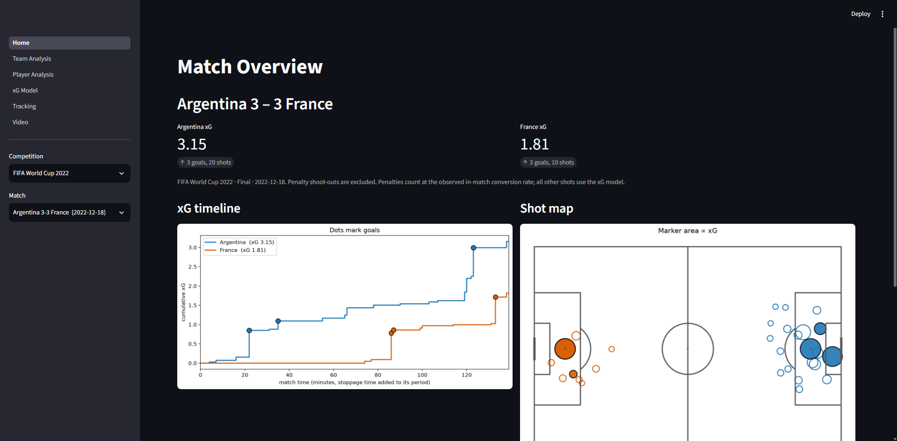
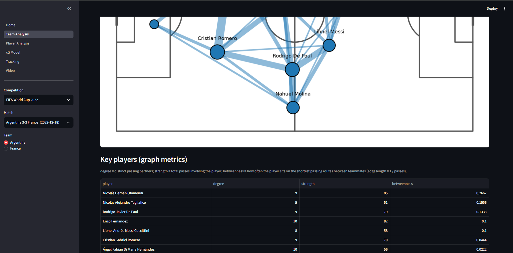

# Football analytics: expected goals, event analysis and tracking

An open-data football analytics project built for an AI degree portfolio. It contains

- an **expected goals (xG) model** trained and evaluated with match-level cross-validation,
  compared against StatsBomb's own xG;
- **event analysis**: shot maps, xG race charts, pass networks with graph metrics, touch
  heatmaps and per-player summaries;
- **tracking analysis** of two Metrica sample matches: cleaned and smoothed speeds, running
  load, team shape, and (honestly reported) formation detection;
- a **Streamlit dashboard** that shows all of it.

Everything uses free, open data and free, open-source libraries and runs on a normal laptop CPU.
Every number in this README is generated from files in `results/` by `scripts/build_summary.py`.

## Screenshots

**Match Overview**: score, xG timeline and shot map (2022 World Cup final).



**Team Analysis**: pass network and the key-player table.



(The dashboard also has Player Analysis, xG Model, Tracking and Video pages. The Video page
plays a broadcast clip, so it is not shown here and the clip is not part of this repository.)

## Quick start

```
git clone <your-repo-url>
cd football-analytics
python -m venv .venv
.venv\Scripts\activate            # Windows  (macOS/Linux: source .venv/bin/activate)
pip install -r requirements.txt
python -m scripts.setup           # downloads data, builds any missing results
streamlit run app/Home.py
```

`scripts.setup` is the single setup command. It downloads and caches the data in `data/raw/`
(about 250 MB, git-ignored) and, if the files are not already in `results/`, trains the xG model
(about 10 minutes) and builds the tracking tables. The committed `results/` folder already
contains them, so on a normal clone setup is only the data download.

**Tested environment:** Python 3.13.2 on Windows 11 with the exact versions in
`requirements-lock.txt`. `requirements.txt` lists minimum versions; Python 3.10 was **not**
tested (the pandas 3 used here itself needs Python 3.11+).

## How to reproduce every result

| What | Command | Writes |
|---|---|---|
| Download data | `python -m scripts.download_data` | `data/raw/` |
| Data statistics (Phase 1) | `python -m scripts.explore_data` | printed + `results/shot_location_density.png` |
| Whole xG experiment: dataset, 5 models, nested CV, calibration, SHAP, error analysis, final model | `python -m scripts.reproduce_xg` | `results/xg_*.csv`, `xg_*.png`, `xg_model.joblib` |
| Shot maps, xG race, pass networks, heatmaps, player table | `python -m scripts.phase3_demo` | `results/phase3/` |
| Tracking: cleaning, physical metrics, shape, formations, Voronoi | `python -m scripts.phase4_tracking` | `results/phase4/` |
| Video: detection, tracking, teams, pitch mapping (optional, needs your own clip) | `python -m scripts.phase7_video` | `results/phase7/` |
| README results block | `python -m scripts.build_summary` | `results/summary.json`, this README |
| All tests | `pytest` | |

All randomness uses the seed in `config.yaml` (`seed: 42`).

## Project layout

```
config.yaml            seed, competitions, pitch sizes, demo match
src/data/              StatsBomb loader (cached), Metrica downloader and parser/cleaner
src/features/          shot geometry (distance, angle, shot cone) and shot features
src/models/            models, nested match-grouped CV, metrics, predict_xg
src/analysis/          event analysis, tracking analysis, xG error analysis
src/viz/               pitch, match plots, xG plots, tracking plots
src/video/             (optional) cut detection, YOLO tracking, teams, homography, rendering
scripts/               every runnable step (see table above)
app/                   Streamlit dashboard (Home.py + pages/)
tests/                 unit tests and checks against the raw data
results/               tables, figures, the saved model (committed)
REPORT_NOTES.md        design decisions, metric explanations, viva questions
```

## Data sources and required attribution

- **Event data: StatsBomb Open Data** (https://github.com/statsbomb/open-data). StatsBomb asks
  that anyone who publishes, shares or distributes research, analysis or insights based on the
  data **states the source as StatsBomb and uses their logo**. The dashboard shows a source
  line and the logo on every page (file: `app/assets/statsbomb_logo.png`). The full
  agreement is in the repository's `LICENSE.pdf`; read it before reuse.

  

  Data provided by StatsBomb (https://github.com/statsbomb/open-data).
- **Tracking data: Metrica Sports sample data**
  (https://github.com/metrica-sports/sample-data). The repository has no formal licence; it
  asks users to be responsible and to **acknowledge the source** for anything public. Sample
  games 1 and 2 (CSV) are used; the data is anonymised.

Raw data is never committed (`.gitignore` excludes `data/raw/` and `data/processed/`).

## Video analysis (optional)

A computer-vision pipeline over a broadcast clip you supply (`config.yaml`, `video.path`;
the clip is **not** in this repo, `data/video/` and all `.mp4` files are git-ignored):

1. **Shots.** The clip is split at camera cuts (colour-histogram jump plus a pixel-change
   spike), and a shot counts as "wide gameplay" if it shows at least five small players on grass.
2. **Detection.** A COCO-pretrained YOLO model (`yolo11s`, nothing trained here) finds people and
   the ball. People whose feet are not on grass (stewards, photographers, spectators) are dropped.
3. **Tracking.** ByteTrack and BoT-SORT (both bundled with Ultralytics) assign IDs, reset at every
   cut. Both are run on the mapped shot and the one with less fragmentation is used.
4. **Teams.** K-means on each track's shirt colour (Lab colour space) splits light and dark kits;
   tracks far from both are labelled "other" (referees, goalkeepers, ambiguous).
5. **Pitch mapping.** Eight hand-picked pitch landmarks (listed in `config.yaml`) give a homography
   for one reference frame; background feature tracking carries it across the shot as the camera
   pans and zooms. Feet positions become pitch coordinates, giving a radar view, heatmaps and
   (unvalidated) speed/distance. Frames count only if the projected pitch lines sit on the
   painted ones.

```
pip install -r requirements-video.txt        # ultralytics (large: PyTorch), opencv-python, lap
python -m scripts.phase7_video               # about 10 minutes on a laptop CPU
```

Outputs go to `results/phase7/`. Videos (`annotated.mp4`, `radar.mp4`) stay local;
tables and heatmaps are committed. To watch the annotated video in the dashboard's **Video**
page, convert it to a browser-friendly format once (needs `ffmpeg` installed on your computer):
`python -m scripts.make_web_videos`. The page is for local use only: the video contains
broadcast footage and must not be put on a public website. To run it faster for free on a GPU, see
[docs/colab_video.md](docs/colab_video.md) (written but not tested).
**Licence note:** Ultralytics is AGPL-3.0; fine for a personal portfolio, check it before
deploying or redistributing the video code. The footage itself remains the rights holder's.

<!-- RESULTS:START (generated by scripts/build_summary.py; do not edit) -->

### Dataset

**Data:** FIFA World Cup 2018, FIFA World Cup 2022, UEFA Euro 2020, UEFA Euro 2024, Copa America 2024: 262 matches, 943,374 events, 6,619 shots.

**xG modelling set:** 6,347 shots from 262 matches (570 goals, goal rate 8.98%). Excluded: 91 in-match penalties and 181 shoot-out kicks.

### xG model results

#### Model comparison (5-fold CV grouped by match, mean ± std across folds)

| model | log_loss | brier | roc_auc | ece |
|---|---|---|---|---|
| constant_rate | 0.3022 +/- 0.0171 | 0.0818 +/- 0.0061 | 0.5000 +/- 0.0000 | 0.0070 +/- 0.0050 |
| logreg_distance | 0.2754 +/- 0.0199 | 0.0766 +/- 0.0057 | 0.7279 +/- 0.0296 | 0.0191 +/- 0.0019 |
| logreg_all | 0.2580 +/- 0.0231 | 0.0717 +/- 0.0070 | 0.7738 +/- 0.0329 | 0.0209 +/- 0.0053 |
| lightgbm | 0.2588 +/- 0.0209 | 0.0722 +/- 0.0065 | 0.7707 +/- 0.0359 | 0.0210 +/- 0.0039 |
| mlp | 0.2589 +/- 0.0228 | 0.0720 +/- 0.0067 | 0.7742 +/- 0.0339 | 0.0199 +/- 0.0015 |
| statsbomb_xg (benchmark) | 0.2444 +/- 0.0226 | 0.0678 +/- 0.0067 | 0.7984 +/- 0.0305 | 0.0201 +/- 0.0032 |

#### Pooled out-of-fold metrics (every shot scored by a model that never saw its match)

| model | log_loss | brier | roc_auc | ece | ece_noise_floor |
|---|---|---|---|---|---|
| constant_rate | 0.3022 | 0.0818 | 0.478 | 0.007 | 0.0064 |
| logreg_distance | 0.2754 | 0.0766 | 0.7259 | 0.012 | 0.0084 |
| logreg_all | 0.258 | 0.0717 | 0.7708 | 0.0087 | 0.0079 |
| lightgbm | 0.2588 | 0.0722 | 0.7664 | 0.0056 | 0.0078 |
| mlp | 0.2589 | 0.072 | 0.7714 | 0.0057 | 0.0076 |
| statsbomb_xg (benchmark) | 0.2444 | 0.0678 | 0.7977 | 0.0091 | 0.0074 |

`ece_noise_floor` = the ECE expected from sampling noise alone if the predictions were exactly right (simulated from each model's own probabilities).


#### Paired per-fold log-loss difference vs `logreg_all` (positive = worse)

| model | mean_diff_vs_logreg_all | std_diff | folds_better_than_logreg_all |
|---|---|---|---|
| constant_rate | 0.0443 | 0.0127 | 0 |
| logreg_distance | 0.0174 | 0.0065 | 0 |
| lightgbm | 0.0008 | 0.0037 | 2 |
| mlp | 0.001 | 0.0033 | 3 |
| statsbomb_xg (benchmark) | -0.0136 | 0.0036 | 5 |

#### With freeze-frame features (defenders in the shot cone, goalkeeper position)

| model | log_loss | brier | roc_auc | ece |
|---|---|---|---|---|
| logreg_all | 0.2524 +/- 0.0228 | 0.0706 +/- 0.0073 | 0.7872 +/- 0.0269 | 0.0209 +/- 0.0051 |
| lightgbm | 0.2538 +/- 0.0208 | 0.0710 +/- 0.0065 | 0.7844 +/- 0.0301 | 0.0223 +/- 0.0028 |
| mlp | 0.2569 +/- 0.0231 | 0.0718 +/- 0.0073 | 0.7817 +/- 0.0300 | 0.0205 +/- 0.0051 |

#### Leave one tournament out

| model | log_loss | brier | roc_auc | ece |
|---|---|---|---|---|
| constant_rate | 0.3020 +/- 0.0296 | 0.0816 +/- 0.0104 | 0.5000 +/- 0.0000 | 0.0133 +/- 0.0065 |
| logreg_distance | 0.2759 +/- 0.0227 | 0.0767 +/- 0.0087 | 0.7223 +/- 0.0224 | 0.0207 +/- 0.0046 |
| logreg_all | 0.2590 +/- 0.0198 | 0.0720 +/- 0.0069 | 0.7661 +/- 0.0147 | 0.0195 +/- 0.0063 |
| lightgbm | 0.2586 +/- 0.0194 | 0.0722 +/- 0.0074 | 0.7680 +/- 0.0169 | 0.0209 +/- 0.0045 |
| mlp | 0.2600 +/- 0.0186 | 0.0724 +/- 0.0065 | 0.7643 +/- 0.0179 | 0.0181 +/- 0.0033 |

#### Key findings (generated from the tables above)

- Lowest mean CV log loss: **logreg_all** (0.2580); the three full models (logistic regression, LightGBM, MLP) differ by less than the paired fold-to-fold spread, so they are statistically tied.
- StatsBomb's own xG scores 0.2444 log loss and is better than `logreg_all` in 5 of 5 folds. It is a benchmark that this project does not beat.
- Adding freeze-frame features moves `logreg_all` from 0.2580 to 0.2524.

### Tracking results

#### Tracking data quality (Metrica sample games 1 and 2)

| game | team | frames | fps | squad_columns | raw_steps_over_12_m/s | raw_max_step_speed_m/s | points_blanked | steps_over_12_m/s_after_cleaning | ball_missing_frames | periods_flipped |
|---|---|---|---|---|---|---|---|---|---|---|
| 1 | home | 145006 | 25.0 | 14 | 236 | 2281.61 | 276 | 0 | 56755 | [2] |
| 1 | away | 145006 | 25.0 | 14 | 220 | 2241.32 | 253 | 0 | 56755 | [2] |
| 2 | home | 141156 | 25.0 | 14 | 766 | 1947.77 | 904 | 0 | 57884 | [1] |
| 2 | away | 141156 | 25.0 | 12 | 329 | 2519.18 | 394 | 0 | 57884 | [1] |

#### Physical output (smoothed speed, outfield players with a full match)

- Game 1: 14 outfield players (both teams) played the full match; distance covered 9,567-11,245 m, top speed up to 36.9 km/h, up to 20 sprints.
- Game 2: 16 outfield players (both teams) played the full match; distance covered 9,245-11,830 m, top speed up to 39.7 km/h, up to 13 sprints.

#### Formation detection reliability

Share of 5-minute windows (per team and possession state) that produced the most common formation string. Low values mean the detected formation is unstable.

| game | variant | team | state | windows | modal_formation | modal_share | distinct_formations |
|---|---|---|---|---|---|---|---|
| 1 | free_k_2to4 | away | in possession | 18 | 4-4-2 | 0.33 | 9 |
| 1 | free_k_2to4 | away | out of possession | 18 | 4-4-2 | 0.33 | 10 |
| 1 | free_k_2to4 | home | in possession | 17 | 6-4 | 0.29 | 8 |
| 1 | free_k_2to4 | home | out of possession | 18 | 4-4-2 | 0.44 | 6 |
| 1 | fixed_k3 | away | in possession | 18 | 4-4-2 | 0.39 | 9 |
| 1 | fixed_k3 | away | out of possession | 18 | 4-4-2 | 0.44 | 7 |
| 1 | fixed_k3 | home | in possession | 17 | 3-3-4 | 0.47 | 7 |
| 1 | fixed_k3 | home | out of possession | 18 | 4-4-2 | 0.78 | 4 |
| 2 | free_k_2to4 | away | in possession | 17 | 2-4-4 | 0.41 | 7 |
| 2 | free_k_2to4 | away | out of possession | 18 | 4-4-2 | 0.39 | 6 |
| 2 | free_k_2to4 | home | in possession | 17 | 4-6 | 0.18 | 14 |
| 2 | free_k_2to4 | home | out of possession | 16 | 4-4-2 | 0.38 | 9 |
| 2 | fixed_k3 | away | in possession | 17 | 2-4-4 | 0.65 | 6 |
| 2 | fixed_k3 | away | out of possession | 18 | 4-4-2 | 0.67 | 5 |
| 2 | fixed_k3 | home | in possession | 17 | 2-4-4 | 0.18 | 11 |
| 2 | fixed_k3 | home | out of possession | 16 | 4-4-2 | 0.62 | 6 |

### Video results (optional Phase 7)

The clip has 3188 frames at 25 fps (1280x720). It was split into 33 shots of at least 1 s; 12 (61.8 s) look like wide gameplay shots and were tracked, the rest (close-ups and other non-gameplay shots) were not analysed.

#### Tracker comparison on the pitch-mapped shot (proxy metrics, not accuracy)

| tracker | frames | players_per_frame | unique_track_ids | mean_track_len_frames | id_to_player_ratio | ball_frames_share |
|---|---|---|---|---|---|---|
| bytetrack.yaml | 201 | 10.4 | 46 | 45.4 | 4.6 | 0.149 |
| botsort.yaml | 201 | 10.48 | 35 | 60.2 | 3.5 | 0.129 |

Chosen tracker: **botsort.yaml** (lower `id_to_player_ratio`, i.e. less track fragmentation). A ratio of 1 would mean every player kept a single ID; the true number of ID switches cannot be measured without hand-labelled frames.

#### Tracking proxies per tracked shot

| segment | start | end | players_per_frame | unique_track_ids | id_to_player_ratio | ball_frames_share | persons_removed_not_on_grass |
|---|---|---|---|---|---|---|---|
| 2 | 112 | 220 | 15.94 | 25 | 1.56 | 0.028 | 79 |
| 4 | 260 | 433 | 5.95 | 26 | 4.33 | 0.393 | 711 |
| 5 | 433 | 591 | 8.47 | 24 | 3.0 | 0.152 | 114 |
| 8 | 787 | 915 | 6.87 | 24 | 3.43 | 0.016 | 266 |
| 10 | 953 | 1046 | 5.94 | 10 | 1.43 | 0.538 | 351 |
| 12 | 1071 | 1235 | 13.98 | 33 | 2.2 | 0.128 | 93 |
| 15 | 1419 | 1489 | 16.76 | 26 | 1.53 | 0.114 | 100 |
| 17 | 1521 | 1722 | 10.48 | 35 | 3.5 | 0.129 | 180 |
| 19 | 1837 | 1962 | 18.04 | 38 | 2.11 | 0.12 | 103 |
| 21 | 2003 | 2130 | 8.46 | 19 | 2.38 | 0.693 | 196 |
| 23 | 2179 | 2318 | 13.06 | 55 | 5.0 | 0.022 | 139 |
| 25 | 2364 | 2423 | 14.61 | 22 | 1.57 | 0.0 | 180 |

#### Pitch mapping (one shot)

- Eight hand-picked landmarks, fit error 0.067 m mean / 0.148 m max (this is how well the homography reproduces its own landmarks, **not** accuracy against the real pitch).
- Pitch mapping used on frames 1521-1721 (8.04 s, 100% of that shot). Frames count only if the projected pitch lines sit on the painted lines (alignment score >= 3.0; 17.05 at the reference frame).
- Shirt-colour teams over all tracked tracks: 118 light-kit, 109 dark-kit, 110 other (referees, goalkeepers, ambiguous or too-short tracks).
- Speed/distance is only available for 8 tracks long enough to estimate; 1 of them has a peak speed above 12 m/s and is flagged as implausible. Treat all values as unvalidated.

| track_id | team | frames | seconds | distance_m | mean_speed_ms | max_speed_ms | implausible_speed |
|---|---|---|---|---|---|---|---|
| 1 | other | 52 | 2.1 | 8.9 | 4.26 | 6.81 | False |
| 2 | light | 200 | 8.0 | 48.9 | 6.12 | 12.49 | True |
| 4 | dark | 201 | 8.0 | 31.2 | 3.88 | 6.38 | False |
| 5 | dark | 137 | 5.5 | 38.3 | 6.99 | 9.83 | False |
| 8 | other | 124 | 5.0 | 12.7 | 2.57 | 11.34 | False |
| 10 | dark | 184 | 7.4 | 32.8 | 4.46 | 8.93 | False |
| 147 | light | 121 | 4.8 | 17.6 | 3.63 | 8.33 | False |
| 266 | other | 51 | 2.0 | 2.9 | 1.43 | 3.18 | False |

<!-- RESULTS:END -->

## Video failure cases (observed)

No accuracy is claimed for any video result: that would need hand-labelled frames, which do
not exist here. What follows was seen in the outputs; the tables above hold the numbers.

- **A hidden cut went undetected at first.** At frame 1722 the broadcast switches from a wide
  camera to a tight one. The colour-histogram cut detector missed it (both shots are mostly
  pitch and crowd), so the tracker and the pitch mapping kept running across it. It was found
  because the camera-motion estimate collapsed (about 6 matched background points instead of
  about 600; a development observation, not saved in `results/`). A pixel-change signal now
  catches it, and a test covers that kind of cut, but other hidden cuts in other clips may
  still slip through.
- **Zoom and camera changes break the pitch mapping.** During development the alignment score
  dropped to chance level right after that cut (again not saved in `results/`; the fixed
  pipeline stops the mapping at the cut). Only the one wide shot with visible box lines was
  mapped; other wide shots would need their own landmarks.
- **IDs fragment.** The tracker issued 1.4 to 5 IDs per player in the tracked shots
  (`id_to_player_ratio`), and 3.5 even on the mapped shot with the better tracker. IDs
  change when players overlap, in crowded penalty-area moments (visible in `annotated.mp4`),
  and during pans and zooms. How many of those are true ID switches is unknown.
- **Non-players are detected.** Many persons per shot were removed by the grass test (see
  `persons_removed_not_on_grass`). The test can also wrongly remove a real player whose
  feet are not on grass (for example on a white line or an advertising board); that was
  not measured.
- **Teams are only partly resolved.** A large share of tracks ended up "other" (see the team
  counts above): referees, goalkeepers in yellow, and short or ambiguous tracks. Changes in
  lighting and shadow can move a shirt colour between clusters.
- **The ball is mostly missed.** It was detected in 0% to 69% of frames depending on the shot.
  A ball in the air is not on the ground plane, so its mapped pitch position is also wrong.
- **Speed and distance are weak.** Only 8 tracks lasted long enough, and one has a peak speed
  above 12 m/s. Players who jump or dive are not on the ground plane the mapping assumes.
- **Drift is not measured by the landmark fit.** The 0.07 m fit error says how well the
  homography reproduces its own eight landmarks. Drift along the shot is checked only through
  the alignment score against painted lines, not against true positions.

## Limitations

- **Narrow data.** The xG model is trained on five men's international tournaments only (see
  Dataset). It may not generalise to club football, other eras or women's football. The
  leave-one-tournament-out table tests unseen tournaments, not unseen competition types.
- **Missing shot-quality information.** The model sees location, body part, play context and
  game state, not goalkeeper reaction, shot power or placement. The freeze-frame variant adds
  defender and goalkeeper positions but is still only a snapshot at the moment of the shot.
- **Small differences between models.** The three full models are tied within noise; a
  more complex model is not justified by this data.
- **Descriptive xG in the dashboard.** The dashboard uses a model fitted on all shots,
  including the match shown, so match-level xG there is descriptive, not an out-of-sample test.
  Penalties are given the observed in-match conversion rate rather than a modelled value.
- **Tracking sample is tiny.** Two matches, anonymised players, no player names. Some raw
  stretches looked like straight-line ramps with impossible speeds (probably gaps filled in
  by the provider, not verified) and were removed; the ball is missing for
  a large share of frames (see tracking table). Possession is approximated from the event feed.
  Sample Game 3 (a different format) is not used.
- **Formation detection is unreliable.** See the reliability table above: the most common
  formation covers only a minority of 5-minute windows in most cases. Treat it as a rough
  description of shape, not a statement of the coach's system.
- **No betting claims.** Nothing here is a predictive betting model and no claim of
  profitability or market edge is made.
- **Licences.** The StatsBomb `LICENSE.pdf` text could not be machine-read during development
  and Metrica has no formal licence; check both before any public or commercial use.

## Future work

- Hand-label a few hundred video frames to measure detection and ID-switch rates properly, and
  detect pitch lines automatically so every wide shot can be mapped without hand-picked landmarks.
- Use StatsBomb 360 freeze-frame data more fully (more matches, richer defender features).
- Evaluate on club data and on more tracking matches; use a proper pitch-control model with
  velocities instead of nearest-player Voronoi.
- Replace approximate possession with an event-synchronised ball-possession model.
